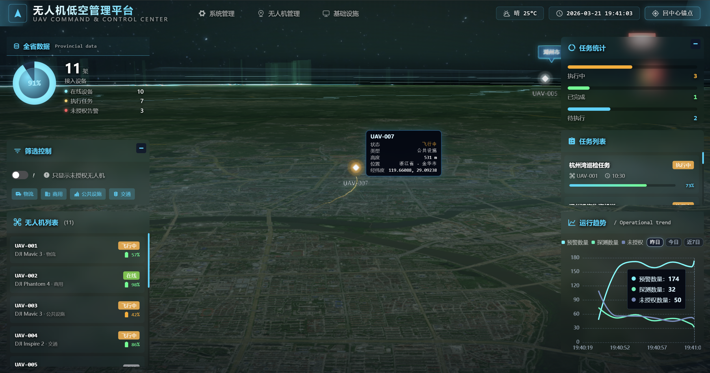
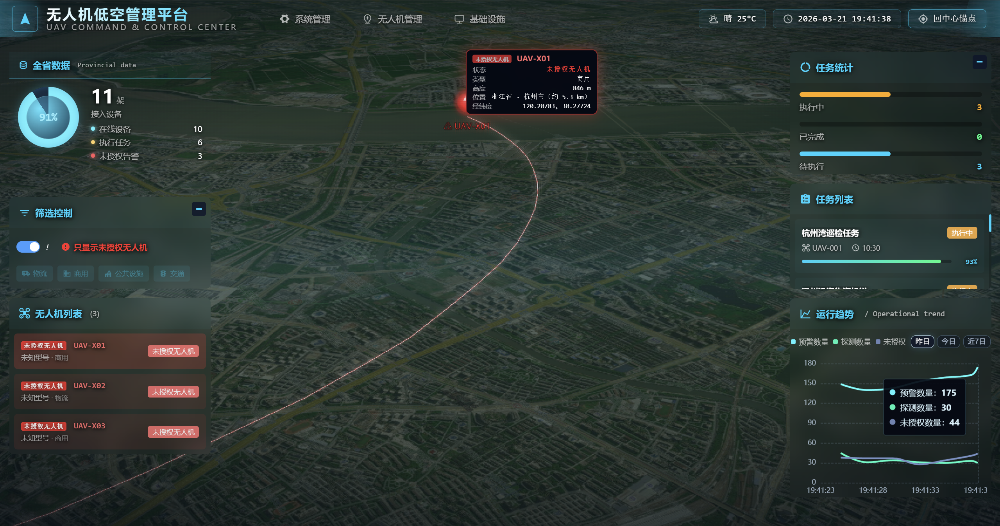
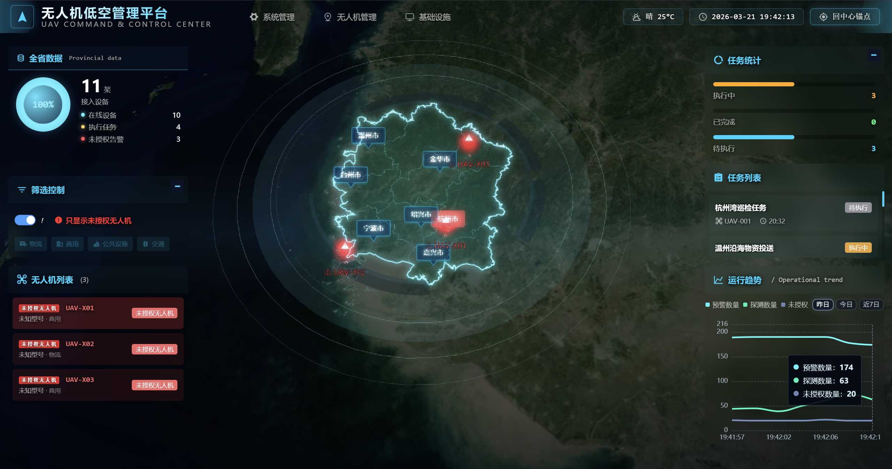
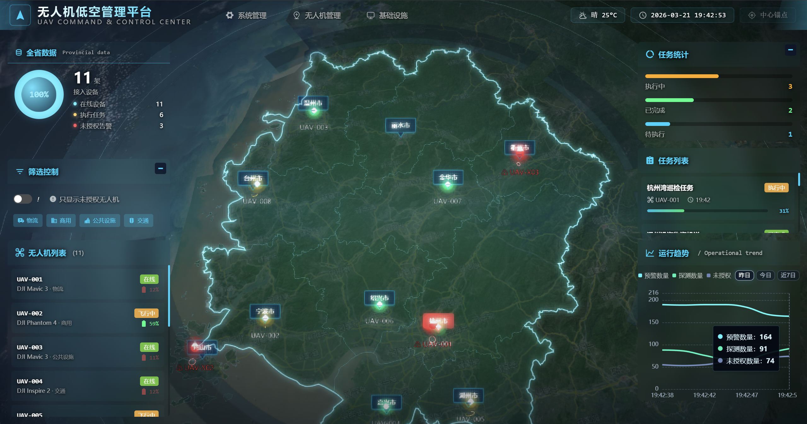
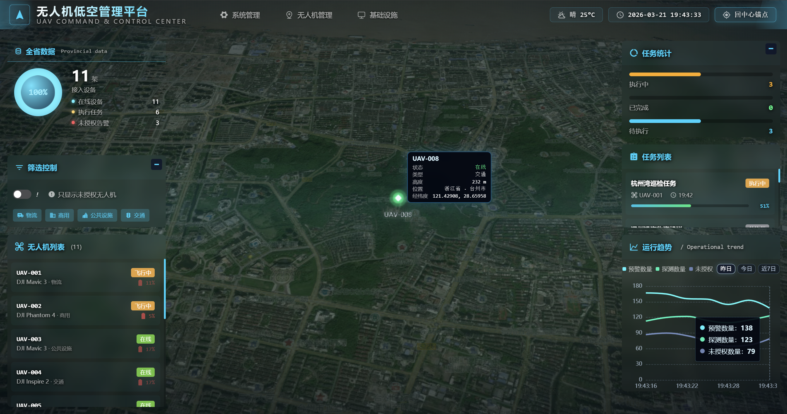

# WRJ 管理平台

基于 [Yudao / ruoyi-vue-pro](https://github.com/YunaiV/ruoyi-vue-pro) 的二次开发项目，后端采用 Spring Boot 多模块架构，前端采用 Vue 3 + Vite + Element Plus，当前仓库包含系统管理、基础设施模块以及首页可视化、地图场景相关定制能力。

## 项目定位

- 基于开源脚手架进行业务定制，而不是从零开始的全新框架
- 适用于后台管理、数据看板、地图可视化等场景
- 仓库同时包含后端、前端、SQL 脚本和部署相关文件

## 技术栈

| 层级 | 技术 |
| --- | --- |
| 后端 | Java 8、Spring Boot 2.7、Maven、MyBatis Plus、Redis、Knife4j |
| 前端 | Vue 3、Vite、TypeScript、Element Plus、Pinia、Vue Router |
| 可视化 | ECharts、Cesium |
| 数据库 | MySQL |

## 已启用模块

根据根目录 `pom.xml`，当前默认启用以下模块：

- `yudao-server`
- `yudao-module-system`
- `yudao-module-infra`

仓库中保留了 `member`、`bpm`、`report`、`mall`、`crm`、`erp`、`iot`、`ai` 等扩展模块目录，默认未在聚合构建中启用，可根据业务需要自行恢复。

## 目录结构

```text
.
├─ yudao-dependencies/      Maven 依赖管理
├─ yudao-framework/         通用框架与 Starter
├─ yudao-server/            后端启动入口
├─ yudao-module-system/     系统管理模块
├─ yudao-module-infra/      基础设施模块
├─ yudao-ui/                Vue 3 前端
├─ sql/                     数据库脚本与工具
├─ sql脚本/                 自定义 SQL 脚本
└─ script/                  部署与辅助脚本
```

## 环境要求

- JDK 8
- Maven 3.8+
- Node.js 16.18+，建议使用较新的 LTS 版本
- pnpm 8+
- MySQL 8.x
- Redis 6.x+

## 本地启动

### 后端

1. 按本地环境修改 `yudao-server/src/main/resources/application-local.yaml`
2. 确保 MySQL、Redis 等依赖可用
3. 在仓库根目录执行：

```bash
mvn -pl yudao-server -am spring-boot:run
```

默认后端端口为 `48080`，接口文档地址为 `http://localhost:48080/swagger-ui`。

### 前端

1. 进入 `yudao-ui` 目录
2. 安装依赖：

```bash
pnpm install
```

3. 根据本地环境调整 `yudao-ui/.env` 与 `yudao-ui/.env.local`
4. 启动前端：

```bash
pnpm dev
```

前端端口由 `VITE_PORT` 控制，当前仓库默认配置值为 `80`，如与本机环境冲突请自行调整。

## 数据与配置说明

- 后端默认激活 `local` profile
- 数据源、Redis、消息队列等本地连接信息建议只保存在 `application-local.yaml`
- 前端环境变量建议将个人化配置保存在 `.env.local`
- 对外发布仓库前，请确认数据库地址、账号密码、地图 Key、加解密 Key 等信息已经脱敏

## 上游来源

- 上游项目：<https://github.com/YunaiV/ruoyi-vue-pro>
- 上游文档：<https://doc.iocoder.cn/>


- 项目截图

   

